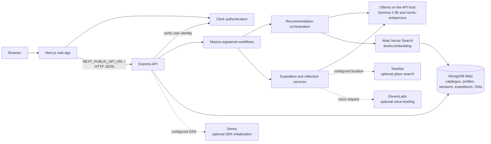

# ExploBook

**Read a story. Live the adventure. Touch grass.**

> **ExploBook doesn't just recommend books. It turns reading into a reason to step outside. Discover your next story, complete real-world quests inspired by your reading journey, and touch grass — one adventure at a time.**

ExploBook connects personalized book discovery with reading reflections and real-world, offline expeditions. A book is the beginning: its themes can inspire a simple walk, observation, or place to visit, and the reader can return to record what they noticed and earn progress. This is the product's take on the **Touch Grass** theme: use the screen to find a reason to put it away.

**Books are the beginning. Real-world exploration is the next chapter.**

## The problem

Digital reading tools can make it easy to stay on-screen through browsing, feeds, and notifications. ExploBook takes a different approach: it uses a book as a starting point for reflection and an optional offline experience, rather than making more screen time the destination.

## How ExploBook works

1. **Discover your reading identity.** Choose genres, goals, reading difficulty, session length, and the kinds of places or activities you enjoy. These preferences seed your Reader DNA.
2. **Find your next book.** Recommendations are selected from the MongoDB book catalogue. Reader preferences and semantic retrieval can help find a fit; Gemma can explain the match.
3. **Enter reading mode.** Start a timed reading session for a selected book. ExploBook records the session; it does not provide the full text of every recommended book.
4. **Reflect on the story.** Save takeaways, an optional quote or passage, a mood rating, pages read, and an optional word you chose to record.
5. **Receive an offline quest.** A Mastra workflow uses the selected book and reader context to generate a real-world expedition. If location is allowed and SerpApi is configured, the workflow can include a nearby place.
6. **Put your phone away.** Grass Mode presents the expedition instructions and encourages a safe walk, observation, nature, discovery, or similar activity with minimal screen interaction.
7. **Return and reflect.** Mark the expedition as started and returned, then record notes, observations, and surprises. These actions record the journey in the app; ExploBook does not independently verify where a person went or what they did.
8. **Earn progress.** Completing an expedition runs a Mastra reflection workflow, awards deterministically calculated XP, may update exploration affinities in Reader DNA, and creates a collectible Orb.
9. **Continue the journey.** The Reading Trail brings reading sessions and expeditions together. Signed-in recommendations can use the reader's saved preferences as the next discovery begins.

AI output depends on the local Ollama service being available. Recommendation responses distinguish Gemma-grounded reasoning from offline fallback output; expedition generation also has a deterministic fallback. See [Key features](#key-features) for optional integrations and limitations.

## Key features

### Core product

- **Personalized discovery and Reader DNA:** onboarding saves genre, goal, difficulty, session-time, and exploration preferences. Expedition reflection analysis can suggest bounded updates to exploration affinities.
- **Catalogue-grounded recommendations:** the API retrieves books already present in the catalogue. It uses MongoDB Atlas Vector Search when available, with repository fallbacks when vector retrieval is unavailable. Gemma supplies recommendation reasoning, not invented catalogue entries.
- **Reading sessions and reflections:** start and complete sessions, record elapsed time and pages, save takeaways and an optional passage, and rate the reading experience.
- **A manually recorded vocabulary word:** readers may add a word to their reflection. It is stored in the takeaways text; this is not a separate vocabulary-learning or AI word-extraction feature.
- **Real-world expeditions:** Mastra workflows generate book-connected expedition instructions and track their lifecycle, including starting, returning, and submitting a reflection. The app encourages offline exploration but does not verify completion through GPS.
- **Progress and collectibles:** deterministic rules calculate XP and levels; completed expeditions award an Orb with a rarity and theme.
- **A persistent journey:** authenticated users can view dashboard data, reading and expedition history in the Reading Trail, and their Orbs.
- **Authentication and user data:** Clerk protects user-specific API operations. Profiles, sessions, expeditions, and progress are stored in MongoDB and scoped to the authenticated user.

### Optional integrations

| Integration | What it does | When it is available |
| --- | --- | --- |
| **SerpApi** | Searches for a nearby place suited to an expedition, such as a park, bookstore, library, or landmark. | Requires `SERPAPI_KEY` and a location supplied for expedition generation. If either is unavailable, the expedition can be generated without a nearby place. |
| **ElevenLabs** | Generates a spoken expedition briefing. | Requires `ELEVENLABS_API_KEY`; the expedition voice and model can be configured. |
| **Sentry** | Optional API SDK initialization. A workflow-event capture helper exists, but no active call sites were found in the current source. | Initializes only when `SENTRY_DSN` contains a non-placeholder DSN. |

These integrations are optional and are not evidence that a hosted deployment is running. Sentry initialization alone should not be read as proof that application events are currently being sent. Ollama is the configured local inference runtime; if it is unavailable, some workflows use their documented offline or deterministic behavior.

## What makes ExploBook different?

| Typical book recommendation experience | ExploBook |
| --- | --- |
| Recommends what to read | Connects a catalogue book to a possible real-world experience |
| Keeps the experience primarily on-screen | Encourages readers to put the phone away during a quest |
| Ends with a book suggestion | Continues through reading reflection, an expedition, and progression |
| Tracks reading alone | Brings reading sessions and outdoor expedition reflections into one journey |

This describes ExploBook's focus, not a claim that other products cannot offer similar features.

## Technology stack

| Area | Technologies |
| --- | --- |
| Workspace | pnpm workspaces; Node.js 22 or newer |
| Web application | Next.js 15.2, React 19, TypeScript, Tailwind CSS 3 |
| API | Node.js, Express 4, TypeScript |
| Authentication | Clerk (`@clerk/nextjs` and `@clerk/express`) |
| Persistence and retrieval | MongoDB Atlas, MongoDB Node.js driver, Atlas Vector Search |
| Generation and embeddings | Ollama with `gemma3:4b-it-q4_K_M` and `nomic-embed-text` |
| Workflow orchestration | Mastra registered workflows |
| Optional place discovery | SerpApi |
| Optional voice briefings | ElevenLabs |
| Optional error monitoring | Sentry SDK (`@sentry/node`; initializes when configured) |
| Shared contracts | `@explobook/shared`, TypeScript, and Zod schemas |

Integrations are implemented in the codebase, but their availability depends on local configuration and credentials. No production hosting provider or live deployment is asserted here.

## Architecture



The web API client calls the Express API directly at `NEXT_PUBLIC_API_URL` (default `http://localhost:4000`); the API's CORS origin is configured with `WEB_ORIGIN`. Mastra workflows are registered on the API's Mastra instance and invoked through its workflow runner. For recommendations, Ollama creates the query embedding and Gemma reasons over retrieved catalogue books. Atlas Vector Search is used when the `vector_index` index is available; the repository also contains retrieval fallbacks. Ollama runs wherever the API can reach it (by default, `http://127.0.0.1:11434`); it is not represented as a cloud-hosted model service.

## Installation and local development

### Prerequisites

- Node.js **22 or newer**.
- pnpm **12.9.1** (the version pinned in the root `package.json`; pnpm 10 or newer is declared as the engine range).
- A MongoDB Atlas database for persistent catalogue and user data.
- A Clerk application for signed-in features.
- Ollama with the configured Gemma and embedding models for local model inference.
- Optional API credentials for SerpApi, ElevenLabs, or Sentry features.

Local model inference can require substantial memory and compute resources, particularly for the Gemma model. Make sure Ollama can load the configured model on your machine.

### Install dependencies

From the repository root:

```bash
corepack enable
pnpm install
```

### Configure environment

Copy the root example for the API environment. In PowerShell:

```powershell
Copy-Item .env.example .env
```

On macOS or Linux, use `cp .env.example .env`. Replace placeholders in `.env` with your own local development settings; do not commit that file.

Next.js loads web environment files from the web app directory. Create `apps/web/.env.local` with the public API URL and Clerk publishable key:

```dotenv
NEXT_PUBLIC_API_URL=http://localhost:4000
NEXT_PUBLIC_CLERK_PUBLISHABLE_KEY=pk_test_your_clerk_publishable_key
```

Set the matching `NEXT_PUBLIC_CLERK_PUBLISHABLE_KEY` and server-side `CLERK_SECRET_KEY` in the root `.env`. Use development credentials from your own Clerk application; never put the secret key in `apps/web/.env.local` or client-side code.

### MongoDB Atlas

1. Create an Atlas cluster and a database user with appropriate access.
2. Allow network access from the machine running the API.
3. Set `MONGODB_URI` and, if desired, `MONGODB_DB_NAME` in the root `.env`.
4. When the API starts with a configured database and an empty catalogue, it seeds the curated book catalogue. It does not overwrite a catalogue that already contains books.
5. For Atlas Vector Search, use a vector index named `vector_index` on `books.embedding`, with 768 dimensions and cosine similarity. The API attempts to create this index when it seeds an empty catalogue; existing catalogues may need the index created in Atlas. If vector search is not available, repository fallbacks are used.

### Ollama

Install and start Ollama, then fetch the exact models used by the current defaults:

```bash
ollama pull gemma3:4b-it-q4_K_M
ollama pull nomic-embed-text
```

The API defaults to `http://127.0.0.1:11434`. Set `OLLAMA_BASE_URL` only if Ollama is running at a different reachable address. `GEMMA_MODEL` and `EMBEDDING_MODEL` default to the model names above.

### Run the applications

Start the API and web app in separate terminals from the repository root:

```bash
pnpm dev:api
```

```bash
pnpm dev:web
```

The API defaults to `http://localhost:4000`; Next.js defaults to `http://localhost:3000`. With Atlas configured, the API connects and seeds the catalogue at startup if it is empty. Open `http://localhost:3000` in a browser. Signed-in features require working Clerk development keys; the public catalogue and public recommendation route do not require a signed-in session.

### Tests, type checks, and builds

Run the workspace scripts from the repository root:

```bash
pnpm test
pnpm typecheck
pnpm build
```

To run only API tests:

```bash
pnpm --filter api test
```

The API and shared package have Vitest tests. The web and UI package `test` scripts currently print that no unit tests are configured; `pnpm test` does not imply browser end-to-end coverage. The workspace `typecheck` and `build` scripts run their package-level scripts recursively.

## Environment variables

Names below are taken from `.env.example` and the runtime configuration. Defaults shown are code defaults, not credentials. Required means needed for the corresponding full feature, not necessarily for the API process to start.

| Variable | Requirement | Purpose / default |
| --- | --- | --- |
| `NODE_ENV` | Optional | API runtime mode; defaults to `development`. |
| `PORT` | Optional | Express port; defaults to `4000`. |
| `WEB_ORIGIN` | Optional | Allowed web origin for API CORS; defaults to `http://localhost:3000`. |
| `NEXT_PUBLIC_API_URL` | Optional for defaults; needed when API is elsewhere | Web API destination; defaults to `http://localhost:4000`. Set for Next.js in `apps/web/.env.local`. |
| `NEXT_PUBLIC_CLERK_PUBLISHABLE_KEY` | Required for Clerk sign-in and authenticated web use | Public Clerk application key. Set in root `.env` for the API and in `apps/web/.env.local` for Next.js. |
| `CLERK_SECRET_KEY` | Required for authenticated API use | Server-side Clerk key; keep it only in root `.env`. |
| `MONGODB_URI` | Required for persistent catalogue and user features | MongoDB Atlas connection string; keep it private. |
| `MONGODB_DB_NAME` | Optional | Database name; defaults to `explobook`. |
| `OLLAMA_BASE_URL` | Optional if using the default local address | Ollama endpoint; defaults to `http://127.0.0.1:11434`. |
| `GEMMA_MODEL` | Optional if using the current model | Generation model; defaults to `gemma3:4b-it-q4_K_M`. |
| `EMBEDDING_MODEL` | Optional if using the current model | Embedding model; defaults to `nomic-embed-text`. |
| `GEMMA_TIMEOUT_MS`, `OLLAMA_TIMEOUT_MS` | Optional | Ollama/Gemma timeout overrides recognized by the API; otherwise the runtime default is 30 seconds. |
| `SERPAPI_KEY` | Optional | Enables nearby place search when location is supplied. |
| `ELEVENLABS_API_KEY` | Optional | Enables voice briefing generation. Keep it server-side. |
| `ELEVENLABS_RECOMMENDATION_VOICE_ID` | Optional | Present in configuration, but no active recommendation voice-generation use was found. |
| `ELEVENLABS_EXPEDITION_VOICE_ID` | Optional | Selects the voice used by the expedition briefing service. |
| `ELEVENLABS_ORB_VOICE_ID` | Optional | Present in configuration, but no active Orb voice-generation use was found. |
| `ELEVENLABS_MODEL_ID` | Optional | ElevenLabs voice model; defaults to `eleven_multilingual_v2`. |
| `SENTRY_DSN` | Optional | Enables Sentry when set to a real, non-placeholder DSN. |
| `SENTRY_ENVIRONMENT` | Optional | Sentry environment label; defaults to `development`. |

Never publish `.env`, `.env.local`, Atlas connection strings, Clerk secrets, or third-party API keys.

## Project structure

```text
.
├── .env.example
├── package.json
├── pnpm-lock.yaml
├── pnpm-workspace.yaml
├── apps/
│   ├── api/
│   │   └── src/
│   │       ├── config/
│   │       ├── database/
│   │       ├── middleware/
│   │       ├── repositories/
│   │       ├── routes/
│   │       ├── services/
│   │       └── __tests__/
│   └── web/
│       ├── app/
│       │   ├── discover/
│       │   ├── journey/
│       │   ├── onboarding/
│       │   ├── orbs/
│       │   └── trail/
│       ├── components/
│       └── lib/
├── packages/
│   ├── shared/
│   │   └── src/
│   │       ├── schemas/
│   │       ├── types/
│   │       └── __tests__/
│   └── ui/
│       └── src/
└── docs/
    ├── 00-README.md, 01-PRD.md, 04-ARCHITECTURE.md
    ├── 12-API-SPEC.md, 16-SECURITY-PRIVACY.md, 17-ENV-RUNBOOK.md
    ├── 27-REAL-WORLD-EXPEDITIONS.md, PHASE-*.md
    └── AI-MEMORY.md
```

The API mounts versioned routes under `/api/v1`, including `/books`, `/recommendations`, `/reader`, `/sessions`, `/expeditions`, `/orbs`, and `/dashboard`. `GET /api/v1/recommendations/public` is the public recommendation route; user-specific operations require Clerk authentication. API health is available at `/health`.

## Privacy and safety

- Expeditions are designed around appropriate public places and low-risk activities. Their generation prompt explicitly rules out dangerous stunts, trespassing, and hazardous terrain. Use judgment about local conditions and choose a safe, accessible alternative whenever needed.
- Location is optional. During expedition generation, the browser may request a **one-time** location using the browser geolocation permission. If granted and `SERPAPI_KEY` is configured, coordinates are sent to the API for a nearby-place search; the selected place, including any returned coordinates, is stored with the expedition in MongoDB. Review the privacy and retention settings of your own deployment and data providers.
- The inspected web flow requests a one-time position; it does not use continuous location watching. Denying or timing out on location still allows a generic expedition without a nearby place.
- The app records expedition state and user reflections, but it does not independently verify that a user physically completed a quest.
- Keep `CLERK_SECRET_KEY` and optional provider secrets server-side. The Clerk publishable key is public and belongs in the web app's `NEXT_PUBLIC_CLERK_PUBLISHABLE_KEY`; never put a secret in a `NEXT_PUBLIC_` variable.

## Current status and roadmap

### Implemented

The core loop includes catalogue discovery, reading-session logging and reflection, Mastra-driven recommendations and expedition workflows, expedition history, and XP/Orb progression. Optional place search and voice briefings require their corresponding configuration. Offline/deterministic behavior exists for some unavailable AI or retrieval paths; check each response's status rather than treating fallback content as model output.

### Roadmap

This repository does not provide a maintained, authoritative release roadmap or a verified production deployment URL. Do not treat open questions or future-facing phase documents as a commitment that a feature is shipped.

The documents under `docs/` include implementation-phase notes and open questions; some are historical planning material and may not reflect the current code. Verify current behavior against the application source.

## Contributing and license

There is no root `CONTRIBUTING.md` or `LICENSE` file in this repository at present. Contribution instructions and the project's license therefore have not been specified here; check with the maintainers before redistributing or contributing.

## Further documentation

- [Product requirements](docs/01-PRD.md)
- [Architecture](docs/04-ARCHITECTURE.md)
- [Database schema](docs/05-DATABASE-SCHEMA.md)
- [Mastra workflows](docs/06-MASTRA.md)
- [API specification](docs/12-API-SPEC.md)
- [Real-world expeditions](docs/27-REAL-WORLD-EXPEDITIONS.md)
- [Environment runbook](docs/17-ENV-RUNBOOK.md)
- [Security and privacy notes](docs/16-SECURITY-PRIVACY.md)
